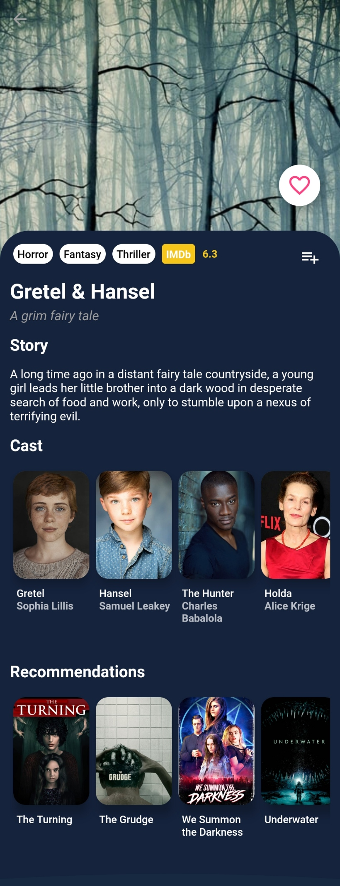
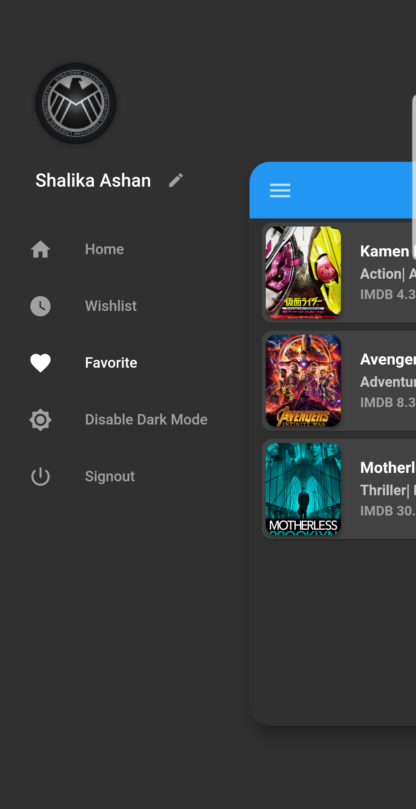
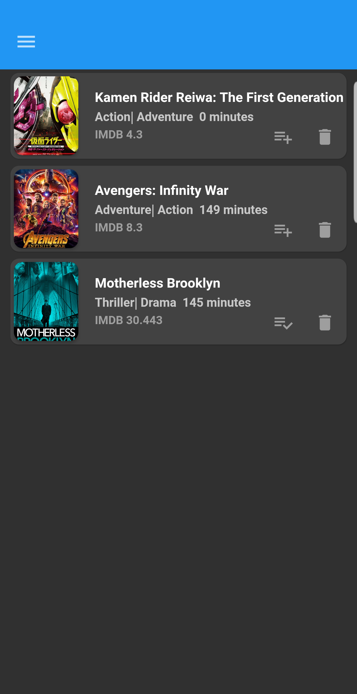

# PoP Corn

This application allows users to discover movies through the app, and it enables features to save movies into two different lists; favourite movie list and wish movie list. Because of this application, users can discover movies with detailed information such as the release date of the movie and the average voting of a movie.  

This application was build using Flutter, and for the database, it uses the firebase firestore database. Also, for the authentication, we used firebase authentication for the PopCorn mobile application. To discover movies, popcorn uses a third-party application developed by [The Movie DB](https://api.themoviedb.org/). This API provides various endpoints to discover movies with more details about movies.

## Screen shots

This application contains with Dark and Light mode feature. Because of that there is two different screen shot foe same view to represent those modes.  

**Home**

&nbsp;&nbsp;

**Movie Preview**

&nbsp;&nbsp;

**Navigation Drawer**

&nbsp;&nbsp;

**Favorite List**

&nbsp;&nbsp;

**Whish list**

&nbsp;&nbsp;

**Loading Skeloton**

&nbsp;&nbsp;

** Splash Screen **

&nbsp;&nbsp;
